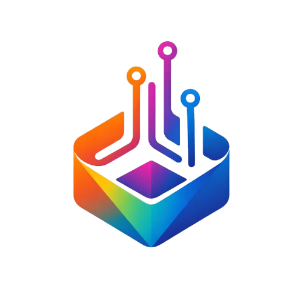

<div align="center">



# WADAH
### Work-simulation AI Driven Augmented Hiring

**Memutus paradoks pengalaman kerja yang membelenggu 7,46 juta talenta muda Indonesia.**

[](https://jerome-88.github.io/wadah-demo)
[](https://github.com/Jerome-88)
[](#)

</div>

---

## 🎯 Tentang WADAH

> *"7,46 juta orang ditolak — bukan karena tidak mampu, tetapi kurangnya pengalaman."*
> — Data BPS 2024

**WADAH** adalah platform karier berbasis AI yang menggantikan sistem CV dan bidding dengan **bukti kerja nyata**. Platform dua sisi ini menghubungkan talenta muda dengan UMKM secara adil, transparan, dan berbasis kompetensi tervalidasi.

```
Learn → Prove → Earn
```

| Untuk Siapa | Masalah Yang Diselesaikan | Solusi WADAH |
|---|---|---|
| 🎓 Fresh Graduate / Mahasiswa | Ditolak karena "tidak punya pengalaman" | Career Sandbox AI + Verified Portfolio |
| 🏢 UMKM / Pengguna Jasa | Susah verifikasi kompetensi kandidat | Smart Matching berbasis skor AI |

---

## ✨ Fitur Utama

### Untuk Penyedia Jasa (Fresh Graduate & Mahasiswa)
- **🤖 AI Career Sandbox** — Simulasi tugas industri nyata dibimbing AI Mentor dengan SOP UMKM asli
- **📊 Verified Portfolio** — Skor kompetensi objektif yang tervalidasi otomatis, bukan sekadar klaim CV
- **🎯 Smart Matching** — Dapat proyek berbayar pertama secara otomatis setelah mencapai threshold skor

### Untuk Pengguna Jasa (UMKM & Bisnis)
- **🔍 AI Clarification** — Ceritakan kebutuhan, AI membantu mengklarifikasi scope proyek
- **✅ 3 Talenta Terkurasi** — Sistem memilihkan 3 talenta paling cocok berdasarkan kecocokan proyek, bukan harga terendah
- **📋 Transparent Portfolio** — Lihat riwayat simulasi, breakdown skor, dan skill terverifikasi sebelum memilih

---

## 🏗️ Arsitektur Sistem

```
┌─────────────────────────────────────────────────────────┐
│                    WADAH PLATFORM                       │
├─────────────────┬───────────────────────────────────────┤
│   PENYEDIA JASA │         PENGGUNA JASA                 │
│                 │                                       │
│  Pilih Skill    │   Ceritakan Kebutuhan                 │
│       ↓         │          ↓                            │
│ Upload CV/Porto │   AI Clarification Chat               │
│       ↓         │          ↓                            │
│  AI Analyzing   │   Smart Task Allocation               │
│       ↓         │          ↓                            │
│ Career Sandbox  │   3 Talenta Terverifikasi             │
│       ↓         │          ↓                            │
│ Verified Score  │   Lihat Portfolio → Hubungi           │
└─────────────────┴───────────────────────────────────────┘
```

### Tech Stack

```
Frontend (Prototipe)    →  HTML · CSS · JavaScript
Mobile (Produksi)       →  Flutter
Backend                 →  FastAPI (Python)
AI/ML                   →  LangChain · RAG · LLM Orchestration
Database                →  PostgreSQL + Vector Database (pgvector)
Infrastructure          →  Cloud-native · Microservices
```

### Algoritma Inti
- **Semantic Scoring (RAG-based)** — Cosine Similarity untuk evaluasi output vs standar SOP industri
- **Weighted Matching Engine (MCDM)** — Multi-Criteria Decision Making dengan 3 parameter: skor AI, kecepatan penyelesaian, relevansi skill

---

## 🚀 Demo Interaktif

Demo prototipe dapat diakses langsung di browser — tidak perlu install apapun.

**[→ Buka Demo WADAH](https://jerome-88.github.io/wadah-demo)**

### Cara Mencoba Demo

**Path 1: Sebagai Penyedia Jasa**
1. Klik **"Mulai Buktikan Kompetensimu"**
2. Pilih 1–3 skill (Social Media, Copywriting, Desain Grafis, dll.)
3. Upload CV/Portfolio atau lewati langkah ini
4. Lihat task simulasi yang disiapkan AI
5. Masuk Dashboard → Chat dengan AI Mentor
6. Ketik `siap` untuk mulai simulasi
7. Selesaikan 2 tugas → dapatkan skor 88/100 + Verified Badge

**Path 2: Sebagai Pengguna Jasa**
1. Klik **"Cari Jasa Sekarang"**
2. Pilih kategori + ceritakan proyek
3. Jawab pertanyaan klarifikasi AI
4. Lihat 3 talenta yang direkomendasikan + alasan matching
5. Klik kartu talenta → lihat Verified Portfolio lengkap

---

## 📁 Struktur Repo

```
wadah-demo/
├── index.html              # Entry point — HTML skeleton
├── assets/
│   └── bot.png             # Logo WADAH AI
├── css/
│   ├── main.css            # Variables, reset, navbar, buttons
│   ├── landing.css         # Hero, path cards, stats row
│   ├── flow.css            # Form, skill cards, upload, matching
│   ├── dashboard.css       # Sidebar, AI mentor panel, task cards
│   └── portfolio.css       # Verified portfolio page
└── js/
    ├── data.js             # Semua mock data & konstanta (load pertama)
    ├── navigation.js       # Routing antar halaman & dashboard
    ├── jasa-flow.js        # Path pengguna jasa
    ├── talent-flow.js      # Path penyedia jasa + upload + AI analysis
    ├── dashboard.js        # AI Mentor chat + score animation
    └── portfolio.js        # Verified portfolio page logic
```

---

## 👥 Tim Waduh

| Nama | Peran | Kontribusi |
|------|-------|------------|
| **Jerome Maxcellino Budianto** | CTO — AI/ML & Software Engineer | Sistem matching, AI simulation engine, demo platform |
| **Kenneth Owen Gozali** | AI/ML Engineer | Engine evaluasi kompetensi, RAG pipeline |
| **Kristanto Winata** | Software Engineer | Arsitektur aplikasi, backend infrastructure |
| **Jollyn Audrey Lee** | CPO — UI/UX & Product Strategy | Pengalaman pengguna, strategi produk & dampak sosial |

**Institusi:** BINUS University
**Kompetisi:** DIGDAYA X Hackathon 2026 — Bank Indonesia, OJK, ASPI

---

## 📊 Dampak yang Ditargetkan

| Metrik | Target Tahun 1 |
|--------|---------------|
| 👤 Total Pengguna | 7.000 (0,1% dari 7,46 juta pengangguran) |
| 🏢 UMKM Partner | 50 UMKM pilot |
| ⭐ Rata-rata Skor Simulasi | ≥ 8.0/10 |
| ⚡ Waktu Dapat Proyek Pertama | < 4 minggu |

---

## 📬 Kontak

**Jerome Maxcellino Budianto**
📧 jeromebudianto@gmail.com
🔗 [github.com/Jerome-88](https://github.com/Jerome-88)

---

<div align="center">

**DIGDAYA X Hackathon 2026 · Bank Indonesia · BINUS University**

*Berinovasi untuk masa depan, memberdayakan talenta digital Indonesia.*

</div>
